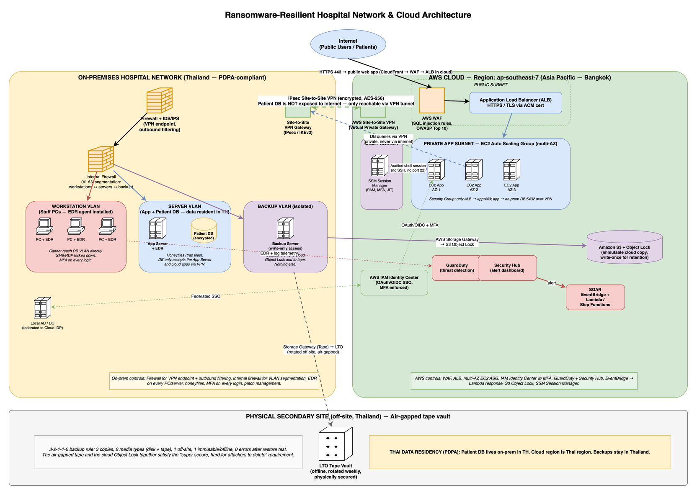

# Question 1 — Ransomware-Resilient Hospital Network Design

**Course:** Network and Cloud Essentials — Final Exam
**Author:** Nyi Htut Zaw
**Date:** 28 April 2026

---

## 1. Scenario Recap

A small hospital runs its patient record system on premises. A recent ransomware attack encrypted a file server and the hospital lost a lot of data and reputation. Management wants a new design that reduces the impact if it happens again.

The design must:

1. Provide the basic hybrid setup (secure connection to cloud, private database access, public access only to the web front end, protection from credential theft).
2. Separate user PCs from the application and database servers — both on premises and in the cloud.
3. Stop ransomware from spreading easily, and allow incident response with automated actions.
4. Back data up to cloud storage **and** a physical secondary site, with one copy that attackers cannot easily delete.
5. Keep patient data in Thailand (PDPA law).

---

## 2. Architecture Diagram

Three zones: **on-premises hospital network** (yellow, left), **AWS cloud in Bangkok** (green, right), and the **off-site backup site** (grey, bottom). They are connected by an encrypted VPN tunnel and a one-way path from the on-prem backup server to immutable cloud storage and to physical tape.

---

## 3. How Each Requirement is Met

**Secure cloud ↔ campus connection (Req 1.1):** The solution uses **AWS Site-to-Site VPN** with encrypted IPsec tunnels between the on-prem firewall and the AWS Virtual Private Gateway (shown as the dashed green line in the diagram). This is the encrypted backbone connecting the two zones.

**Private access to the database (Req 1.2):** The patient database stays on-premises in Thailand. Cloud applications reach it only through the encrypted VPN tunnel — it is never exposed to the public internet. The "DB queries via VPN" arrow in the diagram shows this private path.

**Public access only to the web front end (Req 1.3):** Internet-facing traffic is handled entirely in the cloud through AWS CloudFront, WAF, and Application Load Balancer, all using HTTPS only. The on-prem network does not accept direct internet traffic; it protects internal operations only.

**Protection from credential theft (Req 1.4):** Two identity solutions prevent attackers from stealing credentials. Staff and end-users log in via **AWS IAM Identity Center** with MFA. Cloud administrators access servers through **AWS Systems Manager Session Manager**, which opens audited shell sessions without SSH keys or inbound port 22 — eliminating a major attack vector.

**Separate user PCs from app/DB servers (Req 2):** The solution provides application servers in **both** on-premises and cloud to meet this hybrid requirement. On-premises: three VLANs (workstations, servers, backup) with an internal firewall enforcing strict segmentation — workstations can only reach the app server, not the database directly. In the cloud: three subnets (public, private app, management) provide HA for public users. This architecture means a compromised workstation cannot reach the database, limiting ransomware spread.

**Prevent ransomware from spreading (Req 3.1):** Antivirus and endpoint detection/response (EDR) run on every PC and server. Trap files ("honeyfiles") placed on file shares alert the security team immediately if ransomware begins scanning. MFA on all logins prevents credential reuse. Together, these controls stop lateral movement even if one machine is infected.

**IR investigation + automated actions (Req 3.2):** **AWS GuardDuty** detects threats, **Security Hub** aggregates alerts in one dashboard, and **CloudTrail** + **VPC Flow Logs** provide the audit trail. When an alert fires, **AWS EventBridge** automatically triggers Lambda scripts that isolate affected machines, disable compromised accounts, snapshot disks for analysis, and open tickets — all within minutes.

**Cloud + physical-site backup; one copy hard to delete (Req 4):** The solution follows the **3-2-1-1-0 rule**: 3 copies of data, 2 media types (disk + tape), 1 off-site copy, 1 immutable/offline copy, and 0 errors after restore testing. In practice: the production database is copy #1, cloud snapshots are copy #2, **Amazon S3 with Object Lock** (write-once, immutable) is copy #3, and physical LTO tape shipped to an off-site vault is copy #4 — providing two "super-secure" copies that attackers cannot delete.

**Patient data in Thailand (Req 5):** The patient database runs on-premises in Thailand. All AWS workloads (EC2, S3, backups, logs) are provisioned in the **`ap-southeast-7` Bangkok region**, ensuring data residency compliance with PDPA. The off-site tape vault is also located in Thailand.

---

## 4. Component-by-Component Justification

### 4.1 Dual application tiers — cloud for public, on-prem for internal

**Public internet access:** Patients and external users access the hospital web app via AWS cloud. Traffic flows through **AWS CloudFront** (CDN, TLS 1.3) → **AWS WAF** (blocks SQL injection and OWASP Top 10) → **Application Load Balancer** → cloud EC2 servers. The load balancer spreads traffic across multiple availability zones for high availability.

**Internal local access:** Hospital staff (doctors, nurses, administrators) access patient records from on-prem workstations through the **on-prem app server** for instant local access with no internet latency. 

**Both app servers access the same on-prem database** via encrypted local network (on-prem app) or via the VPN tunnel (cloud app). This hybrid model provides:
- Fast local access for clinical staff (on-prem app server)
- Highly available public-facing API for patients/partners (cloud app servers)
- Single source of truth for patient data (on-prem database)

### 4.2 Internal network — on-prem firewall for segmentation

**On-prem firewall + IDS/IPS** protects **internal** traffic only. Its role is:
- **Segment the three VLANs** — enforce firewall rules so workstations cannot reach the server VLAN or backup VLAN directly. If ransomware infects a PC, the firewall blocks lateral movement.
- **VPN tunnel endpoint** — accept the encrypted IPsec tunnel from the AWS Virtual Private Gateway (ports 500/4500). All cloud-to-on-prem database traffic flows through this secure tunnel.
- **Outbound filtering** — block suspicious outbound connections (ransomware trying to reach attacker C2 servers, data exfiltration attempts).
- **IDS/IPS** — inspect internal traffic for attack signatures.

**Trade-off note:** The VPN tunnel runs over the public internet, so it's slower than a dedicated link (AWS Direct Connect). But VPN is much cheaper and simpler — for a small hospital it's the right starting point.

### 4.3 Network segmentation (the heart of the ransomware fix)

The original attack succeeded because everything was on one flat network — once one PC was infected, ransomware reached the file server easily. The new design splits the network into zones with a firewall between them.

**On-prem** has three isolated VLANs, separated by the internal firewall:

- **Workstation VLAN** — staff PCs (doctors, nurses, administrators). The firewall blocks any attempts to reach the Server or Backup VLANs directly. Workstations must go *through* the app server to access patient data. Antivirus runs on every PC.
- **Server VLAN** — application server and patient database. The firewall allows:
  - Workstations → app server (staff request patient records)
  - App server → database (fetch/update data)
  - Cloud app servers → database (via VPN tunnel, for public users)
  - **No direct workstation-to-database access** — this segmentation prevents ransomware on a PC from directly attacking the database.
- **Backup VLAN** — backup server only. The firewall only allows outbound connections: to cloud immutable storage (S3 Object Lock) and to the tape system. Nothing else can reach this VLAN.

**Cloud** has three subnets:

- **Public subnet** — load balancer only.
- **Private app subnet** — application servers (multi-AZ for HA).
- **Management subnet** — admin access only.

Network segmentation is the single most important control. Even if a PC gets infected, ransomware can't reach the DB or rewrite the backups.

### 4.4 Identity (req 1.4)

- End-user / staff login: **AWS IAM Identity Center** with MFA. One login covers cloud and (federated) on-prem AD.
- Admin access to cloud servers: **AWS Systems Manager Session Manager**. Admins log in through SSO and Session Manager opens an audited shell session — no SSH keys, no inbound port 22. This is the main defence against credential theft, which is how the original ransomware probably got in.

### 4.5 Endpoint protection

- **Antivirus / endpoint protection software** on every workstation and server. Modern endpoint protection notices when something tries to encrypt many files at once and stops it.
- **Trap files** ("honeyfiles") on file shares. Real users have no reason to open them; ransomware sweeping a share will. The first one touched fires a high-severity alert.
- **MFA** on every login that matters (admins, remote staff, system access).

### 4.6 Detection and automated response (req 3.2)

- **Detection**: **AWS GuardDuty** for threat detection in AWS, **AWS Security Hub** to collect alerts in one dashboard, plus **CloudTrail** + **VPC Flow Logs** for the audit trail. Endpoint alerts feed into the same dashboard.
- **Automated response**: when a high-severity alert fires, **AWS EventBridge** triggers an **AWS Lambda** function that automatically (a) cuts the affected machine off the network, (b) disables the user's login, (c) takes a snapshot of disks for later analysis, and (d) opens a ticket. This is the "automated actions" the question asks for.

The point: the auto-response runs in **single-digit minutes**, which is faster than any human can react.

### 4.7 Backup — the 3-2-1-1-0 rule (req 4)

The course teaches the **3-2-1-1-0** backup rule: **3** copies of the data, **2** different media types (disk + tape), **1** copy off-site, **1** copy offline/immutable, and **0** errors after restore tests.

Applied to this hospital:

**Layer 1 — Production:** The on-prem patient database is the live copy.

**Layer 2 — On-prem disk backup:** Regular snapshots managed by **AWS Backup** running inside the backup VLAN. This provides quick recovery if the production DB fails.

**Layer 3 — Cloud immutable backup:** **Amazon S3 with Object Lock** in the Bangkok region. Object Lock enforces write-once retention — even an attacker with admin credentials cannot delete the backup until the retention period expires (typically 90 days). This is the "super secure" copy that survives ransomware attacks on all live systems.

**Layer 4 — Off-site air-gapped tape:** Physical LTO tape written via **AWS Storage Gateway**, then shipped weekly to an off-site vault in Thailand. Tape is air-gapped (no network connection) — ransomware cannot reach it. This is the second "super hard to delete" copy, protecting against scenarios where the cloud itself is compromised.

Two of these copies (Object Lock and offline tape) satisfy the requirement that attackers cannot easily delete backups, providing defense in depth.

### 4.8 Data residency (req 5)

- Patient DB stays on-prem in Thailand.
- AWS resources (cloud apps, S3 backup bucket, logs) are all created in **`ap-southeast-7`** (Bangkok), so data does not leave the country.
- Off-site tape vault is in Thailand.

---

## 5. Why This Beats the Previous Attack

The old design lost data because the file server and its backup were on the same network. The new design fixes three things:

1. **Network segmentation + endpoint protection** — even if a PC is infected, ransomware cannot reach the DB or the backups.
2. **Immutable cloud backup + air-gapped tape** — even if every online system is encrypted, a clean copy survives.
3. **Auto-containment** — affected machines are isolated within minutes, before the attacker reaches the DB.

---

## 6. Incident Response Plan (Task 2)

### 6.1 Framework

We use **NIST SP 800-61 Rev. 2** (the standard incident-response framework). It has four phases:

1. **Preparation** — runbooks, IR-team roster, drills, hardened backups, tools pre-configured.
2. **Detection & Analysis** — alert triage, scope assessment.
3. **Containment, Eradication & Recovery** — stop the spread, clean up, restore.
4. **Post-Incident Activity** — lessons learned, gaps fed back into Preparation.

### 6.2 How a ransomware incident is detected

Detection relies on multiple signals firing together, not just one alert. The security system monitors:

- **Mass encryption activity:** Endpoint protection on PCs and servers detects unusual patterns of file encryption or renaming — when a process tries to encrypt thousands of files in minutes, it's a strong ransomware signal.
- **Backup deletion attempts:** Logs from the backup system alert if something tries to delete snapshots or Access previous versions — attackers often target backups first.
- **Trap file access:** Honeyfiles placed on shared drives fire an immediate alert if any process opens them. Real users never touch these decoy files.
- **Outbound traffic to bad IPs:** The on-prem firewall and IDS flag connections to known malicious IP addresses or command-and-control (C2) servers.
- **User reports:** Staff reporting strange file extensions, ransom notes, or frozen screens immediately escalate to the security team.

When two or more of these signals fire within a short time window, the alert is automatically promoted to a high-severity ransomware playbook, triggering the automated response.

### 6.3 Action timeline

The incident response process follows a strict timeline from detection to recovery:

**T+0 minutes — Detection:** A detection signal fires (EDR alert, backup log, trap file, user report, IDS). The alert is routed to the Security Hub dashboard.

**T+0–5 minutes — Automated containment:** **AWS Lambda** automatically executes containment actions: the affected machine is cut off the network (security group rule, VLAN isolation), the suspect user account is disabled in IAM Identity Center, and disks are snapshotted for later forensics. This is the most critical window — attackers spread fast, and automated response is faster than humans.

**T+5–15 minutes — Triage:** A SOC (Security Operations Center) analyst on-call reviews the alert. Are there false positives? Which machines are affected? Is this a real ransomware attack or a misconfiguration? The analyst confirms and escalates.

**T+15–30 minutes — Incident Response Team activated:** If confirmed, the IR team is paged: security leads, IT operations, legal counsel, and hospital management are notified. Comms protocol begins (what to tell staff, when to notify authorities).

**T+30–60 minutes — Network-level containment:** The on-prem firewall blocks traffic to known attacker IPs. The affected network segment (e.g., the infected VLAN) is isolated further to prevent lateral spread. A forensic team begins collecting logs.

**T+1–4 hours — Eradication:** IR identifies **patient zero** — how did the attack start? Phishing email? Credential theft? Vulnerable service? All affected machines are reimaged (wipe and restore from clean backups).

**T+4–24 hours — Recovery:** Patient data is restored from the immutable backup. If the cloud is suspected to be compromised, the hospital falls back to the air-gapped LTO tape vault. Recovery is tested before systems go back online.

**T+24–72 hours — Monitoring:** Systems are under heightened surveillance for signs of persistence (backdoors, lateral movement). Monitoring continues 24/7 for 72 hours.

**Within 72 hours — PDPA notification:** If patient data was encrypted or stolen, the hospital notifies the Thai Personal Data Protection Committee per PDPA Article 37 breach notification requirements.

**T+1 week — Post-incident review:** The IR team meets to document the root cause, lessons learned, and gaps in controls. Runbooks are updated.

**The key point:** Automated containment in single-digit minutes limits damage. Humans take over for investigation and recovery starting at T+5 min, which is still faster than an attacker's next move.

---

## 7. Summary

The previous attack succeeded because the network was flat and the backup was reachable from the same network as the file server. The new design fixes this with a perimeter that exposes only HTTPS, a private VPN path to the patient DB, three segmented zones on each side that stop east-west spread, AWS-native detection and auto-containment that runs in minutes, and a 3-2-1-1-0 backup strategy where one copy is immutable in S3 and another is on offline tape — both stored in Thailand. NIST SP 800-61 governs the incident-response process, with a defined timeline from T+0 detection to a one-week post-mortem.

---

## References

1. NIST Special Publication 800-61 Rev. 2 — *Computer Security Incident Handling Guide*. https://csrc.nist.gov/publications/detail/sp/800-61/rev-2/final
2. CISA — *#StopRansomware Guide*. https://www.cisa.gov/stopransomware
3. Thailand Personal Data Protection Act, B.E. 2562 (PDPA), 2019 — Article 37 (breach notification).
4. Veeam — *3-2-1-1-0 Backup Rule*. https://www.veeam.com/blog/321-backup-rule.html
5. AWS — *Amazon S3 Object Lock*. https://docs.aws.amazon.com/AmazonS3/latest/userguide/object-lock.html
6. AWS — *AWS Backup overview*. https://docs.aws.amazon.com/aws-backup/latest/devguide/whatisbackup.html
