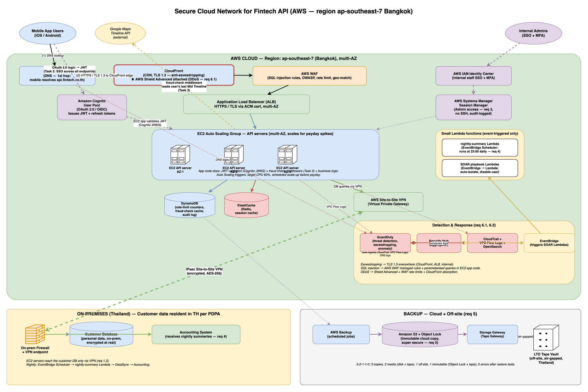

# Question 2 — Secure Cloud Network for Fintech API

**Course:** Network and Cloud Essentials — Final Exam
**Author:** Nyi Htut Zaw
**Date:** 28 April 2026

---

## 1. Scenario Recap

A fintech startup runs mobile payment APIs in the cloud. Customers use the APIs from iOS / Android apps. Internal staff need admin access. There's a small on-premises accounting system that pulls transaction summaries every night. **Customer data must remain on-premises in Thailand** per the PDPA.

The platform must:

1. Provide the basic hybrid setup (secure cloud↔on-prem, private DB, public access only to API front end, credential-theft protection).
2. Keep the API **always available** and able to handle **ultra-high load** on payday.
3. Allow internal admins to access the cloud safely.
4. Push nightly transaction summaries from cloud to the on-prem accounting system.
5. Back up data to cloud + a physical site, with one super-secure copy.
6. Detect eavesdropping, SQL injection, and DDoS, and run automated incident response.

The exam tasks:

- **Task 1**: Design a solution that supports all requirements.
- **Task 2**: Design how a mobile-app user authenticates **once** and uses all API endpoints.
- **Task 3**: Design API-side geo-fraud detection that denies access if the user is not in Thailand or visited specific countries in the last 3 months, using the user's Google Maps location history.

---

## 2. Architecture Diagram



Three zones: **AWS cloud** (green, top), **on-premises** (yellow, bottom-left), and **off-site backup** (grey, bottom-right). The cloud handles mobile API traffic; customer data stays on-prem; backups go to immutable cloud storage plus tape.

---

## 3. How Each Requirement is Met

**Secure cloud ↔ on-prem connection (Req 1.1):** The solution uses **AWS Site-to-Site VPN** with encrypted IPsec tunnels between the on-prem firewall and AWS Virtual Private Gateway. This encrypted backbone allows cloud and on-prem systems to communicate securely over the internet.

**Private access to the database (Req 1.2):** The customer database stays on-prem. Cloud API servers reach it only through the encrypted VPN tunnel — the database never accepts direct internet connections. The "DB queries via VPN" path is the exclusive route.

**Public access only to API front end (Req 1.3):** Internet traffic reaches only the API endpoints through **Route 53** (DNS) → **CloudFront** (CDN, TLS 1.3) → **AWS WAF** (SQL injection + OWASP rules) → **Application Load Balancer** → EC2 API servers. Nothing else is public-facing. The on-prem network does not accept any internet traffic.

**Credential-theft protection (Req 1.4):** End-users authenticate via **Amazon Cognito** (OAuth 2.0, MFA-enabled, returns JWT). Internal admins use **AWS IAM Identity Center** for single sign-on with MFA. Admin access to cloud servers goes through **AWS Systems Manager Session Manager** — no SSH keys, no inbound port 22, every session audited.

**API always available (Req 2.1):** The solution uses **Route 53** health-checked DNS failover to redirect traffic if the primary stack fails. **EC2 Auto Scaling group** spans three Availability Zones for redundancy. **Multi-AZ databases** (DynamoDB, ElastiCache, and on-prem customer DB replication) ensure data survives AZ failures.

**Ultra-high payday load (Req 2.2):** The **EC2 Auto Scaling group** uses two scaling strategies: (1) **Target tracking** keeps average CPU at 60%, adding instances when traffic rises; (2) **Scheduled scale-up** increases capacity before known payday windows (e.g., end of month) so the system is ready before the spike. This combination handles predictable spikes without cold-start delays.

**Admin secure access (Req 3):** All internal staff use **AWS IAM Identity Center** for single sign-on with MFA. Admins access EC2 instances via **Session Manager**, an audited shell that requires no SSH keys and leaves a full audit trail.

**Nightly summary to on-prem accounting (Req 4):** **EventBridge Scheduler** runs a cron rule at 23:00 daily, triggering the **nightly-summary Lambda** function. This small function reads the day's transactions from DynamoDB, aggregates them, and pushes the summary file over the VPN to the on-prem accounting system.

**Backup to cloud + physical site, one super-secure copy (Req 5):** The solution follows the **3-2-1-1-0 rule**: production data, cloud snapshots, immutable S3 with Object Lock, and off-site LTO tape. Two of these copies (S3 Object Lock and air-gapped tape) are "super secure" — attackers cannot delete them.

**Detect eavesdropping / SQL injection / DDoS (Req 6.1):** (a) **Eavesdropping**: TLS 1.3 everywhere (CloudFront to client, ALB to EC2, EC2 to databases). (b) **SQL injection**: AWS WAF blocks SQL injection patterns at the edge; all EC2 code uses parameterized queries (defense in depth). (c) **DDoS**: **AWS Shield Advanced** protects CloudFront and ALB; CloudFront absorbs volumetric attacks at the edge; WAF rate-limit rules stop application-layer floods.

**IR investigation + automated actions (Req 6.2):** **GuardDuty** detects threats, **Security Hub** aggregates alerts in one dashboard. When a high-severity alert fires, **EventBridge** triggers **SOAR Lambda** scripts that automatically isolate affected machines, disable compromised accounts, snapshot disks for forensics, and open tickets.

---

## Compute Architecture Note

The main API tier runs on **EC2 Auto Scaling group + ALB** for consistency with Q1 and to handle predictable payday spikes via scheduled scaling. Small **Lambda** functions are used only where they fit best:
- **Nightly cron job** (req 4): runs 1 minute/day, so EC2 would waste resources.
- **SOAR playbooks** (req 6.2): triggered by alerts, short-lived, event-driven — ideal Lambda use cases.

This hybrid approach buys operational simplicity without sacrificing auto-scaling capability.

---

## 4. Component-by-Component Justification

### 4.1 Edge — Route 53, Shield, CloudFront, WAF

- **Route 53** does DNS with health-checked failover. If the primary stack is unhealthy, traffic is redirected to a secondary region — the foundation of "always available". *Note: Route 53 is auto-integrated with CloudFront — enabling CloudFront automatically includes Route 53 DNS routing.*
- **AWS Shield Advanced** is enabled because the question explicitly asks for DDoS detection. Shield Standard is free and on by default; Advanced adds 24/7 DDoS response support and cost protection during attacks. For a payments API where downtime = lost transactions, the cost is justified. *Note: Shield is auto-integrated with CloudFront — enabling Shield protects all CloudFront distributions automatically.*
- **CloudFront** sits in front of the ALB. It absorbs DDoS at the edge and terminates TLS 1.3 close to the user — the practical answer to the eavesdropping requirement.
- **AWS WAF** has the AWS-managed SQL-injection rule set, OWASP rules, IP rate limiting, and a geo-match rule that allows only Thai IPs (a coarse fraud filter; Task 3 has a finer-grained version).

### 4.2 API tier — ALB + EC2 Auto Scaling Group

- **Application Load Balancer (ALB)** terminates HTTPS, distributes traffic across the EC2 instances, and runs health checks.
- **EC2 Auto Scaling group** runs the API server code. Configured to span **three Availability Zones** for HA. Auto-scaling rules:
  - **Target tracking**: keep average CPU at 60%; ASG adds instances when CPU rises.
  - **Scheduled scale-up**: before known payday windows (e.g., end-of-month days), scale up in advance so capacity is ready before the spike hits.
- Inside the EC2 application code:
  - **JWT validation** against Cognito's published keys (a standard library does this — same idea as JWT validation in any stateless web app).
  - **fraud-check middleware** (Task 3) — runs before each business endpoint and decides allow/deny.
  - **Business logic**: payments, user-profile, transactions, etc.
- **Trade-off accepted**: EC2 ASG takes a few minutes to scale up — slower than Lambda, which scales instantly. For payday spikes the scheduled scale-up handles this; for unexpected spikes, target tracking adds capacity within 2–3 minutes. Acceptable for a fintech API; if it weren't, we'd pre-warm with higher minimum capacity.

### 4.3 Cloud-side data

- **DynamoDB** for short-lived data. Why DynamoDB for each type:
  - **Rate-limit counters**: Need sub-millisecond reads/writes on every API request. DynamoDB's single-digit millisecond latency is ideal — strong choice for high-frequency lookups on payday.
  - **Fraud-check decision cache**: 30-minute TTL per request. DynamoDB TTL feature auto-expires entries — no cleanup code needed. Key-value access pattern fits perfectly.
  - **Audit log**: High write throughput on payday (millions of requests). DynamoDB on-demand scaling handles spikes without capacity planning; each API call logs a record.
- **ElastiCache (Redis)** as a hot cache to reduce DynamoDB load on payday spikes (session caching, temporary decision cache).
- **Customer PII stays on-prem** — the PDPA hard line. All customer data, transaction history, and account info remain in the on-premises database, never copied to cloud.

### 4.4 Connectivity to on-prem

- **AWS Site-to-Site VPN** with the Virtual Private Gateway. IPsec/AES-256.
- The on-prem firewall accepts only the VPN tunnel from the AWS public IP, on the specific ports the cloud apps need.
- **Trade-off accepted**: VPN goes over the internet, so internet outages affect us. AWS Direct Connect is faster and more reliable but costs more and takes weeks to provision. For a startup, VPN is the right starting point.

### 4.5 Identity (req 1.4 + Task 2)

- **End users** → **Amazon Cognito**. OAuth 2.0 / OIDC, MFA available, returns a signed JWT. (Full flow in §5.)
- **Admins** → **AWS IAM Identity Center** for SSO with MFA. Once logged in, admins reach EC2 instances through **AWS Systems Manager Session Manager** — no SSH keys, no inbound port 22, every session audited.

### 4.6 Nightly summary push (req 4)

This is one of the two places where a small Lambda is the right tool:

- **EventBridge Scheduler** fires a cron rule at 23:00 Bangkok time daily.
- It triggers the **`nightly-summary` Lambda** which reads the day's transactions, aggregates them, and writes a file to a private S3 bucket.
- **AWS DataSync** (running in the VPC) pushes the file over the VPN to the on-prem accounting server.
- *Why Lambda here?* It's a 1-minute job that runs once a day. Provisioning an EC2 instance for that would waste 23 hours and 59 minutes of every day.

### 4.7 Backup (req 5)

The solution follows the **3-2-1-1-0 rule**: 3 copies of data, 2 media types (disk + tape), 1 off-site copy, 1 offline/immutable copy, 0 errors after restore tests.

**Layer 1 — Production:** DynamoDB (cloud) and customer database (on-prem) are the live copies.

**Layer 2 — Cloud disk backup:** **AWS Backup** creates snapshots of DynamoDB and other AWS resources. These are quick to restore if a resource fails in the same region.

**Layer 3 — Cloud immutable backup:** **Amazon S3 with Object Lock** (same as Q1) provides write-once retention. Even an attacker with admin credentials cannot delete the backup until the retention period expires (typically 90 days). This is the "super-secure" copy that survives ransomware attacks on all live cloud systems.

**Layer 4 — Off-site air-gapped tape:** **AWS Storage Gateway** writes snapshots to physical LTO tape, which is then rotated weekly to an off-site vault in Thailand. Tape is air-gapped (no network connection) — ransomware cannot reach it. This is the second "super hard to delete" copy, protecting against scenarios where the cloud itself is compromised.

### 4.8 Detection and IR (req 6.1, 6.2)

- **Eavesdropping** → TLS 1.3 from mobile app to CloudFront, then TLS internally between AWS services. Certificates from AWS Certificate Manager.
- **SQL injection** → AWS WAF managed SQL-injection ruleset blocks the obvious patterns at the edge, and all EC2 application code uses parameterised queries (defence in depth: WAF can be bypassed, parameterised queries cannot).
- **DDoS** → AWS Shield Advanced detects volumetric attacks; CloudFront absorbs them; WAF rate-limit rules stop application-layer floods.
- **Investigation** → CloudTrail (every API call), VPC Flow Logs (network metadata), GuardDuty (alerts — *note: GuardDuty auto-ingests CloudTrail, VPC Flow Logs, and Route 53 DNS logs, no manual wiring needed*), Security Hub (one dashboard).
- **Automated response** → This is the second place where small Lambdas are the right tool. **EventBridge** → **SOAR Lambdas** run scripts: block source IP at WAF, disable a Cognito user, snapshot affected EC2 disks, open a ticket. Same pattern as Q1.

---

## 5. Task 2 — One Login, All API Endpoints

The requirement is single sign-on for the mobile app: the user authenticates **once**, then uses every API endpoint without logging in again per endpoint.

### Method: OAuth 2.0 + JWT, via Amazon Cognito (validated by the EC2 app)

```
Mobile app  ──(1) login: username + password + MFA──►  Amazon Cognito User Pool
            ◄─(2) returns a signed JWT (access token + refresh token)──

Mobile app  ──(3) GET /api/v1/transactions
                  Authorization: Bearer <JWT>──────►  CloudFront → WAF → ALB → EC2
                                                                                │
                                              (4) EC2 app middleware validates JWT:
                                                  ─ signature is valid (Cognito JWKS)
                                                  ─ token not expired
                                                  ─ token issued by our Cognito pool
                                                                                │
                                                       (5) accept → forward to handler
                                                           reject → 401 Unauthorized
```

### Why this works as SSO across endpoints

- **One login, many endpoints**: every endpoint runs the same JWT validation middleware. The JWT from step 2 works on all of them — that's the SSO.
- **Stateless**: the EC2 app validates the JWT signature locally without calling Cognito on every request — scales fine for payday traffic.
- **Token lifecycle**:
  - Access token: ~15 minutes (short, limits damage if leaked).
  - Refresh token: ~30 days (the mobile app silently swaps it for a new access token).
- **Revocation**: if a user's account is compromised, an admin disables them in Cognito → all existing tokens fail validation almost immediately.
- **MFA**: enforced at the Cognito login step (SMS, TOTP, etc.).

### Trade-offs accepted

- JWTs cannot be invalidated mid-life without extra work. I'm relying on the short access-token TTL.
- Cognito has a learning curve; an alternative is Auth0 or Okta as a third-party IDP. I'm picking Cognito because it's AWS-native and integrates cleanly.

---

## 6. Task 3 — Geo-Fraud Detection Using Google Maps Location History

**Requirement**: deny API access if the user is not currently in Thailand, **or** if they visited specific blocklisted countries in the last 3 months — using the user's Google Maps location history.

### Method overview

The fraud check runs as **middleware in the EC2 application code**, just after JWT validation and before the business handler. It allows or denies based on the user's location.

```
Mobile app  ──► CloudFront → WAF → ALB → EC2 ──(a) validate JWT (Cognito)
                                              ──(b) fraud-check middleware
                                                       │
                                                       │ uses the user's stored Google OAuth token
                                                       │ to call:
                                                       ▼
                                               Google Maps Timeline API
                                               (last 90 days of location history)
                                                       │
                                              ──(c) allow → run business handler
                                                  deny → 403 Forbidden
```

### Step-by-step

1. **One-time enrollment** (during signup):
   - The mobile app shows a Google "sign in" + "share Location History" consent screen.
   - On consent, Google returns an OAuth refresh token. The app sends it to our backend, which stores it encrypted in **AWS Secrets Manager**, keyed by the user's Cognito ID.

2. **On each API request** (cached in DynamoDB for ~30 min to avoid Google rate limits):
   - The fraud-check middleware on EC2:
     - Reads the user's Cognito ID from the JWT.
     - Looks up the encrypted Google token in Secrets Manager.
     - Calls the Google Maps Timeline API for the last 90 days.
     - Runs the rules below.
     - Caches the decision in DynamoDB with a 30-minute TTL.
     - Logs an audit record.

3. **Decision rules**:
   - **Rule A** — current location must be in Thailand. If not, deny.
   - **Rule B** — if the user visited any country on the company's blocklist in the last 3 months, deny.
   - **Rule C** — if the timeline shows physically impossible movement (Bangkok → New York → Bangkok in 2 hours), the data is fake → deny.
   - **Rule D** (fallback) — if the user did not consent to share Google data, fall back to: IP geolocation (must be Thai) + device GPS reported by the app. Lower confidence → smaller transaction limits.

4. **Failure modes**:
   - Google API down → cached decisions remain valid for 30 min, then fall back to IP + device GPS.
   - User turns off Location History → treat as "no consent" → fallback rules.

### Why this design

- Reuses standard pieces: JWT validation proves *who*; fraud-check middleware proves *where*. Both run in the same EC2 process — no extra hop.
- Audit trail: every decision logged.
- Privacy-aware: only the user's own location history is read; only the OAuth token (not raw history) is stored long-term.

### Trade-offs accepted

- Sharing Google Location History is a big ask. Users who opt out get lower transaction limits, not denied service.
- Google may rate-limit. The 30-min cache and the IP fallback handle this.
- The blocklist of countries is a business decision — needs governance.

---

## 7. Summary

The fintech API platform sits behind a layered AWS edge (Shield + CloudFront + WAF + ALB) with a multi-AZ EC2 Auto Scaling group serving the actual API requests. Customer data stays on-prem in Thailand for PDPA, reached only over an IPsec VPN. End users authenticate once via Amazon Cognito (OAuth 2.0 + JWT) and the same token is accepted by every endpoint. Geo-fraud rules run as middleware in the EC2 app using the user's Google Maps location history. Backups follow 3-2-1-1-0 with S3 Object Lock plus off-site tape. Detection and response use GuardDuty + Security Hub + small EventBridge → Lambda scripts for automation. Eavesdropping, SQL injection, and DDoS are addressed in depth at the edge.

---

## References

1. AWS — *Application Load Balancer overview*. https://docs.aws.amazon.com/elasticloadbalancing/latest/application/introduction.html
2. AWS — *Amazon EC2 Auto Scaling*. https://docs.aws.amazon.com/autoscaling/ec2/userguide/what-is-amazon-ec2-auto-scaling.html
3. AWS — *AWS WAF managed rule groups*. https://docs.aws.amazon.com/waf/latest/developerguide/aws-managed-rule-groups.html
4. AWS — *AWS Shield Advanced*. https://docs.aws.amazon.com/waf/latest/developerguide/shield-chapter.html
5. AWS — *Amazon S3 Object Lock*. https://docs.aws.amazon.com/AmazonS3/latest/userguide/object-lock.html
6. RFC 6749 — *The OAuth 2.0 Authorization Framework*.
7. RFC 7519 — *JSON Web Token (JWT)*.
8. Google Maps Platform — *Timeline / Semantic Location History API*.
9. NIST SP 800-61 Rev. 2 — *Computer Security Incident Handling Guide*.
