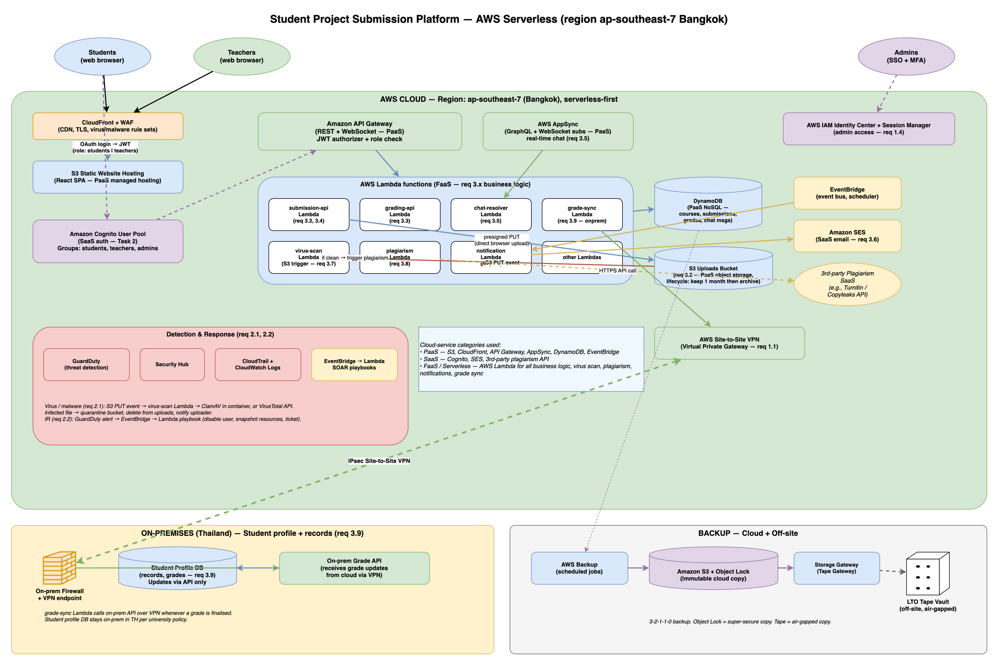

# Question 3 — Rapid Development of a Student Submission Platform

**Course:** Network and Cloud Essentials — Final Exam
**Author:** Nyi Htut Zaw
**Date:** 28 April 2026

---

## 1. Scenario Recap

A software team is building a student project submission platform. They want to ship quickly with minimal upfront server hardware and minimal long-term maintenance.

The platform must:

1. Provide the basic hybrid baseline (secure cloud↔on-prem connection, private DB access, public access only to the web front end, credential-theft protection).
2. Detect virus and malware, and run automated incident response.
3. Provide these features:
   - Student / teacher login with **different roles** and data permissions.
   - File upload with large temporary storage (late submissions allowed for one month).
   - Teacher review dashboard and grading.
   - Student submission view dashboard.
   - Student / teacher chat.
   - Email notifications on submission and grading.
   - Auto virus scan after upload.
   - AI-based plagiarism detection.
   - Student profile and records on-prem; grades updatable via API.

Tasks:
- **Task 1**: Design a solution. Identify which cloud-service category (PaaS, SaaS, FaaS / serverless) is used for which purpose.
- **Task 2**: Design the student / teacher login and role-taking method.

The phrase **"minimal server hardware"** is the design driver: this answer is **serverless-first**, leaning heavily on managed AWS services so the team writes business logic, not infrastructure code.

---

## 2. Architecture Diagram



Three zones: **AWS cloud** (green, top — almost everything lives here), **on-premises** (yellow, bottom-left — only the student profile DB and grade API), and **off-site backup** (grey, bottom-right).

---

## 3. Cloud-Service Categories — Which Service for What (Task 1)

Task 1 explicitly asks to identify which cloud-service category is used for which purpose. The design uses four categories:

### 3.1 SaaS — Third-party managed services (we consume them, we don't run them)

- **Amazon Cognito User Pool** — handles student and teacher login, MFA, password resets, and group membership. The app never writes auth code; Cognito does it all. Returns a JWT.
- **Amazon SES** — sends email notifications (submission receipt, grade announcement). The app calls SendEmail with a template; SES handles delivery.
- **AWS IAM Identity Center** — admin staff login with MFA and single sign-on. Paired with Session Manager for audited shell access (no SSH keys).
- **3rd-party plagiarism API** (Turnitin / Copyleaks) — external service called from a Lambda to check submissions against a corpus.
- **Amazon GuardDuty** — automated threat detection. We don't operate it; we configure it and read its alerts.
- **AWS Backup** — managed backup orchestration. We configure it; AWS runs the snapshots.

### 3.2 PaaS — AWS-managed platforms (AWS runs the infrastructure; we configure and use)

- **Amazon S3** — object storage for file uploads and the React frontend bundle. Lifecycle rules auto-delete old submissions (after 60 days) and move to Glacier (after 30 days).
- **Amazon CloudFront** — CDN for the React frontend; serves TLS 1.3, caches static assets, protects against DDoS.
- **Amazon API Gateway** — REST API and WebSocket endpoint. Routes requests to Lambdas, enforces authentication, provides rate limiting.
- **AWS AppSync** — GraphQL API with WebSocket subscriptions for real-time chat. No server to manage; it scales automatically.
- **Amazon DynamoDB** — NoSQL database for submission metadata, grades, chat messages, plagiarism scores. Scales on demand; no capacity planning.
- **Amazon EventBridge** — event bus routing. Publish events (file uploaded, graded) and trigger Lambdas asynchronously.
- **AWS CloudTrail + CloudWatch Logs** — audit trail of every API call and application log.
- **AWS Site-to-Site VPN** — encrypted tunnel to the on-prem grade API.

### 3.3 FaaS / Serverless — Lambda for all business logic (we write code; AWS runs it on demand)

Every Lambda function represents a feature:

- **`submission-api` Lambda** — handles student API calls: get submissions, upload, check status. Talks to DynamoDB.
- **`grading-api` Lambda** — handles teacher API calls: list submissions, submit grades, retrieve rubrics.
- **`chat-resolver` Lambda** — AppSync GraphQL resolver. Persists messages to DynamoDB, subscriptions handled by AppSync.
- **`virus-scan` Lambda** — triggered by S3 PUT event. Calls VirusTotal or runs ClamAV; moves infected files to quarantine.
- **`plagiarism` Lambda** — triggered by EventBridge after virus scan passes. Calls 3rd-party plagiarism API, stores result in DynamoDB.
- **`notification` Lambda** — triggered by EventBridge when submission received or graded. Calls SES to email students/teachers.
- **`grade-sync` Lambda** — runs on a cron (e.g., once daily) via EventBridge Scheduler. Reads finalised grades from DynamoDB, pushes to the on-prem grade API over the VPN.

### 3.4 IaaS — deliberately none

There are **no EC2 instances, no Kubernetes clusters, no self-managed servers**. This is the team's explicit constraint: "minimal server hardware." If something ever required a self-hosted component (e.g., a local ClamAV signature cache), I'd run it as **ECS Fargate containers** (still serverless, no VM management).

---

## Summary: How This Mix Enables Speed

This is the point of the question: by assembling SaaS + PaaS + FaaS services, the team buys most of the platform and writes only the differentiated business logic (the Lambdas). The team never writes auth, email, scanning, plagiarism detection, or infrastructure code — all consumed as APIs or managed services. The remaining work is **glue code + React UI** — the actual competitive advantage. That's how a small software team gets a real platform up in weeks instead of quarters.

---

## 4. Requirements → Component Mapping

**Baseline hybrid requirements (Req 1):**

- **Secure cloud↔on-prem connection (1.1):** AWS Site-to-Site VPN with IPsec/AES-256 encryption.
- **Private access to the database (1.2):** Student profile database stays on-prem in Thailand. Cloud components access it only via the VPN tunnel to the on-prem grade API; the database never accepts public internet connections.
- **Public access only to web front end (1.3):** Internet traffic reaches only the React SPA (S3 + CloudFront) and the public API endpoints (API Gateway). Nothing else is exposed. WAF is attached to CloudFront to filter DDoS and injection attacks.
- **Credential-theft protection (1.4):** Cognito enforces MFA for student and teacher logins. Internal admins use IAM Identity Center + Session Manager — no SSH keys, no inbound port 22, every session audited.

**Detection and IR (Req 2):**

- **Detect virus and malware (2.1):** S3 PUT event automatically triggers the `virus-scan` Lambda, which calls VirusTotal API or runs ClamAV. Infected files are moved to a quarantine folder and the student is notified.
- **IR investigation + automated actions (2.2):** GuardDuty detects threats; Security Hub aggregates alerts. When a high-severity alert fires, EventBridge triggers SOAR Lambda playbooks that automatically disable a compromised user, snapshot affected resources, and open a ticket.

**Platform features (Req 3):**

- **Student/teacher login + roles (3.1):** Amazon Cognito User Pool with three groups: `students`, `teachers`, `admins`. The JWT includes a `cognito:groups` claim. Every Lambda reads this claim and enforces RBAC (students can only access their own submissions; teachers access their courses).
- **Large temp file upload (3.2):** S3 bucket with a lifecycle rule: move objects to Glacier after 30 days, delete after 60 days. Supports late submissions.
- **Teacher grading dashboard (3.3):** React SPA (teacher view) → API Gateway → `grading-api` Lambda → DynamoDB.
- **Student submission view dashboard (3.4):** React SPA (student view) → API Gateway → `submission-api` Lambda → DynamoDB.
- **Student/teacher chat (3.5):** AWS AppSync GraphQL subscriptions (WebSocket) → `chat-resolver` Lambda → DynamoDB. Real-time message sync.
- **Email notifications (3.6):** EventBridge rule triggers `notification` Lambda when a submission is received or graded. Lambda calls SES to email the affected user.
- **Auto virus scan after upload (3.7):** S3 PUT event → `virus-scan` Lambda (automatic, no manual trigger needed).
- **AI plagiarism detection (3.8):** After virus scan passes, EventBridge publishes an event. `plagiarism` Lambda is triggered, calls a 3rd-party API (Turnitin / Copyleaks), stores the score in DynamoDB.
- **Profile + records on-prem (3.9):** Student profile database stays on-prem in Thailand (PDPA compliance). The `grade-sync` Lambda reads finalised grades from the cloud and writes them to the on-prem grade API over the VPN.

---

## 5. End-to-end Flows (the interesting ones)

### 5.1 Student uploads a project file (req 3.2 + 3.7 + 3.8 + 3.6)

1. Student logs in → Cognito → JWT.
2. The browser asks the `submission-api` Lambda for a temporary upload URL.
3. The browser uploads the file directly to S3 using that URL. (The Lambda never sees the file itself — saves cost and time.)
4. The S3 upload triggers the `virus-scan` Lambda automatically.
   - **Infected** → file moved to `quarantine/`, removed from uploads, student emailed.
   - **Clean** → an event is published on EventBridge.
5. EventBridge fan-out (parallel):
   - `plagiarism` Lambda → calls the 3rd-party plagiarism API → stores the score in DynamoDB.
   - `notification` Lambda → sends "your file was received" email via SES.
6. The student dashboard reads the submission status from DynamoDB.

### 5.2 Teacher grades a submission (req 3.3 + 3.6 + 3.9)

1. Teacher logs in → Cognito JWT shows the group is `teachers`.
2. Teacher opens the grading dashboard → API Gateway → `grading-api` Lambda → DynamoDB.
3. Teacher submits a grade → Lambda saves it in DynamoDB and publishes a "grade finalised" event.
4. EventBridge fan-out:
   - `notification` Lambda → emails the student via SES.
   - `grade-sync` Lambda → calls the on-prem grade API over the VPN → records the grade in the on-prem student profile DB.

### 5.3 Student / teacher chat (req 3.5)

- AWS AppSync exposes a GraphQL subscription endpoint over WebSocket.
- Cognito-authenticated client connects, subscribes to a chat thread, sends/receives messages in real time.
- `chat-resolver` Lambda persists each message to DynamoDB.

---

## 6. Task 2 — Login and Role-Taking Method

### Method: Amazon Cognito User Pool + Cognito Groups + JWT role claim + Lambda RBAC

```
Browser ──(1) login: email + password + MFA──►  Amazon Cognito User Pool
        ◄─(2) returns JWT (id token + access token)─

  JWT payload (decoded — illustrative):
  {
    "sub": "abc-123-uuid",
    "email": "alice@uni.edu",
    "cognito:groups": ["students"],         ← role(s) here
    "custom:student_id": "S60012345",
    "exp": 1714291200,
    ...
  }

Browser ──(3) GET /grading/dashboard  Authorization: Bearer <JWT>──►  API Gateway
                                                                     │
                                                  (4) Cognito authorizer validates JWT
                                                                     │
                                                  (5) request reaches `grading-api` Lambda
                                                                     │
                                                  (6) Lambda reads cognito:groups
                                                      if "teachers" not in groups → 403
                                                      else → proceed
```

### Where roles are assigned

Two simple options:

1. **By email domain at signup** — `*@student.uni.edu` → added to the `students` group automatically. `*@uni.edu` → added to `teachers`. A small Cognito trigger function does this when a user signs up.
2. **Manually by admin** — an admin tool can flip a user's group for edge cases (TAs, exchange students).

(Could also let students sign in with their existing university account if the university already has a single sign-on system — Cognito supports this. I'd start with native Cognito for speed, add federation later.)

### How role-based access is enforced

Cognito does login; the application checks roles. Two layers:

- **Coarse (route level)** — different routes for students vs teachers (`/student/*` vs `/teacher/*`). The Cognito authorizer rejects calls from the wrong group.
- **Fine (record level)** — inside each Lambda:
  - A student can only read or write their **own** submissions.
  - A teacher can read all submissions for courses they teach, and write grades for those.

### Why this is a good answer for this course

- **Cognito** handles login, MFA, and password resets — no auth code to maintain.
- The role is **inside the JWT** — every Lambda can check it without a DB lookup.
- One mental model — student, teacher, admin — same mechanism, only the group changes.

### Trade-offs accepted

- Cognito's login UI has limited customisation; for a heavily branded login the team would build their own UI on top of Cognito's API.
- For very fine-grained sharing (like Google Drive permissions), groups alone aren't enough — I'd store per-record ACLs in DynamoDB. The exam's requirement is simple role separation, so groups are enough.

---

## 7. Detection and IR (req 2)

### Virus / malware (req 2.1)

- Every file uploaded to S3 triggers the `virus-scan` Lambda automatically. Two options for the scanning engine:
  - **VirusTotal API** (SaaS) — easy, broad coverage, paid per call.
  - **ClamAV** running inside a Lambda container — free, but signatures need updating daily.
- Infected file → moved to a `quarantine/` folder, deleted from uploads, student emailed, ticket created.

### Incident response (req 2.2)

- **Detection**: AWS GuardDuty (threat detection), Security Hub (alert dashboard), CloudTrail (audit), CloudWatch Logs.
- **Automated response**: EventBridge → Lambda runs scripts that disable a compromised user, snapshot affected resources, and open a ticket.
- **Framework**: NIST SP 800-61 (same as Q1).

---

## 8. Backup (3-2-1-1-0)

The platform follows the same 3-2-1-1-0 rule as Q1 and Q2: 3 copies, 2 media types, 1 off-site, 1 offline/immutable, 0 errors on restore.

**Layer 1 — Production:** DynamoDB tables (submissions, grades, chat), S3 uploads bucket, and on-prem student profile database are the live copies.

**Layer 2 — Cloud disk backup:** AWS Backup automatically snapshots DynamoDB and S3. These are quick to restore if a resource fails within the same region.

**Layer 3 — Cloud immutable:** Amazon S3 with Object Lock provides write-once retention — even an attacker with admin credentials cannot delete backups until retention expires (typically 90 days). This copy survives ransomware attacks on all live systems.

**Layer 4 — Off-site air-gapped:** AWS Storage Gateway (Tape Gateway) writes snapshots to physical LTO tape, rotated weekly to an off-site vault in Thailand. Tape is air-gapped (no network) — ransomware cannot reach it. This is the second "super-hard to delete" copy.

---

## 9. Why this design lets the team ship fast

The exam's goal for Q3 is to show I understand the **value** of cloud service categories, not just name them. Here is how each category buys speed:

- **SaaS** removes whole problem domains. The team will *never* write an email-sending service, an auth flow, or a virus scanner — three multi-week projects, all consumed as APIs.
- **PaaS** removes infrastructure work. No Postgres tuning, no load balancer config, no patching. The team configures and uses.
- **FaaS** removes operations. Lambda runs the code on demand; the team writes business logic and trusts AWS to scale it.

The remaining work is **glue code + UI** — exactly the differentiated value. That's how a small software team gets a real platform up in weeks instead of quarters.

---

## 10. Summary

A serverless-first AWS architecture: React SPA on S3+CloudFront, public APIs through API Gateway and AppSync, all business logic in Lambda, persistent metadata in DynamoDB, file uploads in S3 with a 30-day lifecycle. Cognito User Pool with student / teacher / admin groups handles auth and roles; API Gateway and Lambdas enforce RBAC using the `cognito:groups` claim in the JWT. Virus scan runs on S3 PUT; plagiarism check follows via EventBridge to a 3rd-party SaaS. Email notifications via SES. Student profile DB and grade API stay on-prem; the cloud `grade-sync` Lambda updates grades over a Site-to-Site VPN. Backups follow 3-2-1-1-0 with S3 Object Lock plus off-site tape. Detection and response use GuardDuty + Security Hub + EventBridge → Lambda. The result: minimal upfront hardware, the team ships fast, AWS runs the boring parts.

---

## References

1. AWS — *Amazon Cognito User Pool groups*. https://docs.aws.amazon.com/cognito/latest/developerguide/cognito-user-pools-user-groups.html
2. AWS — *AWS AppSync real-time GraphQL subscriptions*. https://docs.aws.amazon.com/appsync/latest/devguide/real-time-data.html
3. AWS — *Amazon S3 lifecycle configuration*. https://docs.aws.amazon.com/AmazonS3/latest/userguide/object-lifecycle-mgmt.html
4. AWS — *S3 event notifications to Lambda*. https://docs.aws.amazon.com/AmazonS3/latest/userguide/NotificationHowTo.html
5. AWS — *Amazon SES Developer Guide*. https://docs.aws.amazon.com/ses/latest/dg/Welcome.html
6. NIST — *Definition of cloud computing (SP 800-145)* — IaaS / PaaS / SaaS / FaaS taxonomy.
7. RFC 7519 — *JSON Web Token (JWT)*.
8. VirusTotal — *Public API documentation*. https://docs.virustotal.com/
9. Turnitin / Copyleaks API documentation (3rd-party plagiarism detection).
