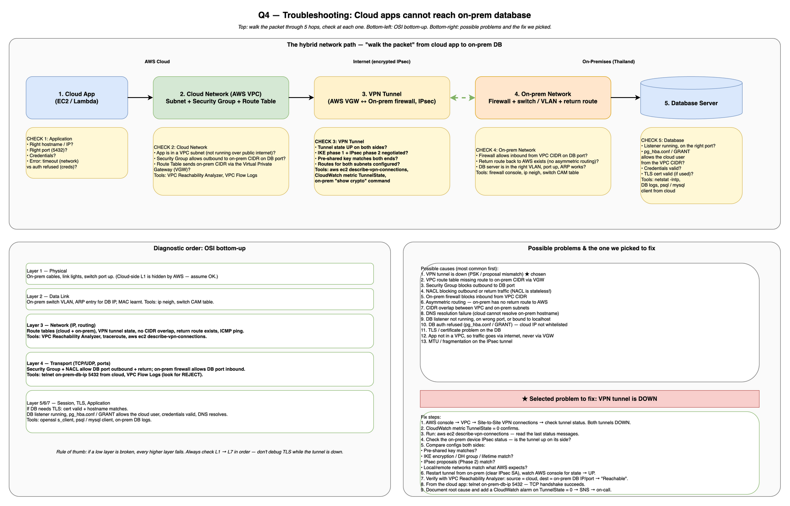

# Question 4 — Troubleshooting Cloud Services

**Course:** Network and Cloud Essentials — Final Exam
**Author:** Nyi Htut Zaw
**Date:** 28 April 2026

---

## 1. Scenario Recap

The university student-portal platform cannot be deployed because the **cloud apps cannot reach the on-prem database**. The development team needs to find the root cause and fix it.

The exam tasks:

- **Task 1**: Design a method to determine the cause. Which devices, modules, networks, services, and software should be investigated, and how?
- **Task 2**: List possible problems. Pick one and design a fix.

---

## 2. Diagram

The diagram has three regions:

- **Top half** — the normal hybrid path with a *Check N* callout at every hop.
- **Bottom-left** — OSI bottom-up diagnostic order with the tools to use at each layer.
- **Bottom-right** — the list of possible causes plus the one we picked to fix.

---

## 3. Task 1 — Diagnostic Method: "Walk the Packet" + OSI Bottom-Up

Two complementary approaches, used together:

1. **Walk the packet** from source (cloud app) to destination (on-prem DB). At each hop, ask: *can the packet still get through here?*
2. **OSI bottom-up** within each hop: physical → data link → network → transport → application. If a low layer is broken, every higher layer fails — so don't waste time debugging TLS while the tunnel is down.

This combined approach is what the course's troubleshooting cheat sheet teaches, applied to a hybrid AWS scenario.

### 3.1 The five hops along the path

**Hop 1: Cloud app (EC2 / Lambda).** Check that the app is connecting to the right hostname, right port, right credentials, and with a sensible timeout. How: read the connection string in the app code or config; check application logs (is the error "timeout" — a network problem — or "auth refused" — a credential problem?).

**Hop 2: Cloud network (VPC subnet + Security Group + Route Table).** Check that the app is in a VPC subnet (not public internet–bound), the Security Group allows outbound traffic to the on-prem CIDR on the DB port, and the route table is configured to send on-prem CIDR traffic via the Virtual Private Gateway (VGW). How: VPC console to verify the app's ENI is in the right subnet, SG rules; **VPC Reachability Analyzer** to test subnet-to-destination; **VPC Flow Logs** to check for REJECT packets.

**Hop 3: VPN tunnel (AWS VGW ↔ on-prem firewall, IPsec).** Check that the tunnel state is UP on both sides, IKE phase 1 + IPsec phase 2 are negotiated, the pre-shared key matches, and both sides have routes for the other's subnets. How: `aws ec2 describe-vpn-connections` to poll AWS tunnel state; CloudWatch metric `TunnelState` should be 1 (UP); on-prem router/firewall console `show crypto isakmp sa` (Cisco) to verify both phases are established.

**Hop 4: On-prem network (firewall + switch / VLAN + return route).** Check that the on-prem firewall allows inbound from the VPC CIDR on the DB port, a return route to AWS exists (no asymmetric routing), and the DB server is in the right VLAN with the port up. How: firewall console ACL rules; on-prem routing table to verify return route to AWS CIDR exists; switch CAM table to verify DB server MAC is learnt on the right VLAN port.

**Hop 5: DB server.** Check that the listener is running on the right port, `pg_hba.conf` (PostgreSQL) / `GRANT` (MySQL) allows the cloud user's IP from the VPC CIDR, credentials are valid, and TLS cert (if required) is valid. How: `netstat -lntp` on the DB server to verify listener; DB server logs; `psql` / `mysql` client from the cloud to test authentication; `openssl s_client` to check TLS cert validity.

### 3.2 OSI bottom-up checklist

**L1 — Physical.** Check cables, link lights, and on-prem switch ports. Cloud-side L1 is managed by AWS so assume it's OK. Tools: eyeballs and switch console.

**L2 — Data Link.** On-prem: check the switch VLAN is correct, ARP has an entry for the DB IP, and the DB's MAC is learnt by the switch. Tools: switch CAM table, `arp -a` command.

**L3 — Network.** Check route tables (both cloud and on-prem), VPN tunnel is UP, no CIDR overlap between VPC and on-prem, return route from on-prem to AWS exists, ICMP ping works. Tools: **VPC Reachability Analyzer**, `traceroute`, `aws ec2 describe-vpn-connections`.

**L4 — Transport.** Check Security Group + NACL allow outbound to the DB port and return traffic (NACLs are stateless, easy to miss the return rule), on-prem firewall allows inbound from the VPC CIDR, TCP handshake completes. Tools: `telnet on-prem-db-ip 5432` from cloud to test TCP handshake; **VPC Flow Logs** to find REJECT packets.

**L5/L6 — Session / Presentation (TLS).** If the DB requires TLS: check the certificate is valid, trusted, and the hostname matches; SNI is sent. Tools: `openssl s_client -connect db:5432`.

**L7 — Application.** Check the DB listener is running on the right port, `pg_hba.conf` (PostgreSQL) / `GRANT` (MySQL) permits the cloud user from the VPC CIDR, credentials are valid, DNS resolves the hostname. Tools: `psql` / `mysql` client from cloud; on-prem DB logs.

### 3.3 Devices, modules, networks, services, software (the question's list)

The question explicitly asks me to enumerate which of each to investigate:

- **Devices**: cloud Lambda/EC2 instance, VPC route table, Virtual Private Gateway, on-prem firewall, on-prem router, on-prem switch, DB server.
- **Modules**: IPsec tunnel (IKE phase 1, IPsec phase 2), BGP/static routing module on the VGW, on-prem VPN endpoint module.
- **Networks**: AWS VPC CIDR, on-prem subnet CIDR, internet path between VGW public IP and on-prem public IP.
- **Services**: VPC Reachability Analyzer, CloudWatch (`TunnelState` metric, Lambda logs), CloudTrail, VPC Flow Logs, DNS (Route 53 Resolver / on-prem DNS).
- **Software**: `ping`, `traceroute`, `telnet`, `nc`, `openssl s_client`, `dig`, `psql`/`mysql` client, AWS CLI (`aws ec2 describe-vpn-connections`).

### 3.4 The first three commands I'd actually run

A senior engineer doesn't read the full checklist top to bottom every time. The fastest first three checks:

1. **`aws ec2 describe-vpn-connections`** — is the tunnel even up? Solves ~50% of these incidents in ten seconds.
2. **VPC Reachability Analyzer** with source = the Lambda's ENI and destination = on-prem DB IP/port — AWS will tell you *exactly* which hop is blocking.
3. **`telnet on-prem-db-ip 5432`** from a cloud test instance — if TCP handshake succeeds, it's an app-layer problem (creds, GRANT). If it fails, it's a network-layer problem.

These three pin down the layer in < 5 minutes.

---

## 4. Task 2 — Possible Problems

Common causes, listed roughly most-likely-first:

1. **VPN tunnel is down** (PSK or IPsec proposal mismatch) — L3. The tunnel state shows DOWN; pre-shared key or IKE/IPsec parameters don't match between AWS and on-prem.

2. **Route table missing route to on-prem CIDR via VGW** — L3. The VPC route table has no entry for the on-prem CIDR pointing to the Virtual Private Gateway.

3. **Security Group blocks outbound to DB port** — L4. The EC2 / Lambda's SG has no outbound rule permitting the on-prem DB CIDR on the DB port.

4. **NACL blocks outbound or return traffic** — L4. NACLs are stateless, so both outbound *and* return traffic rules must be present. Easy to add outbound 5432 but forget the return rule.

5. **On-prem firewall blocks inbound from VPC CIDR** — L4. The on-prem firewall ACL doesn't allow inbound from the VPC CIDR on the DB port.

6. **Asymmetric routing** — L3. Packets from cloud to on-prem get through, but return traffic takes a different path (e.g., via a different router) that doesn't arrive back.

7. **CIDR overlap between VPC and on-prem subnets** — L3. The VPC CIDR accidentally overlaps with the on-prem CIDR; routing becomes ambiguous.

8. **DNS resolution failure** — L7. The cloud Lambda cannot resolve the on-prem DB hostname because the VPC Resolver Endpoint is not configured to forward queries to on-prem DNS.

9. **DB listener not running, on wrong port, or bound to localhost only** — L7. The database server is not listening, or is listening on a different port than the app expects, or is bound to 127.0.0.1 (won't accept remote connections).

10. **DB auth refused** — L7. The cloud user's IP address is not in `pg_hba.conf` (PostgreSQL) or does not have a `GRANT` (MySQL), or the credentials are wrong.

11. **TLS / certificate problem** — L5/L6. The DB's TLS certificate is invalid, expired, untrusted, or the hostname doesn't match.

12. **Lambda not configured to run in a VPC** — L3. The Lambda is running without an ENI in the VPC, so its outbound traffic goes via the public internet (NAT Gateway), never through the VPN tunnel.

13. **MTU / fragmentation problem on the IPsec tunnel** — L3. The tunnel MTU is too small; packets are fragmented, causing performance issues or silent drops.

---

## 5. Selected Problem and Fix: VPN Tunnel Is Down

I picked **#1 — VPN tunnel is down** because it is the single most common cause of "cloud cannot reach on-prem", and because it lets me show the full diagnostic + fix loop end-to-end.

### 5.1 How we know it's this problem

1. **AWS console → VPC → Site-to-Site VPN Connections** → both tunnels show status **DOWN**.
2. **CloudWatch metric `TunnelState` = 0** for the connection — confirms.
3. `aws ec2 describe-vpn-connections --vpn-connection-id vpn-xxx` — last status message says e.g. *"No proposal chosen"* or *"Phase 2 IPsec SA is not established"*.
4. From the on-prem router: `show crypto isakmp sa` (Cisco) or equivalent — the SA is in `MM_NO_STATE` or absent.
5. **VPC Reachability Analyzer** with source = Lambda ENI, destination = on-prem DB port → reports *"Not reachable: VGW route exists, but no active VPN tunnel"*.

### 5.2 Fix steps

The fix is to align the IPsec configuration on both sides until the tunnels come up.

1. **Pull the AWS-side config** for the VPN connection (AWS console → "Download Configuration" gives a vendor-specific config file).
2. **Compare line-by-line** with the on-prem router/firewall configuration. Common mismatches:
   - **Pre-shared key** — typo or copy-paste error.
   - **IKE phase 1 proposal** — encryption (AES-256), DH group (14/19), lifetime — all must match.
   - **IPsec phase 2 proposal** — same idea.
   - **Local / remote networks** — AWS expects to see exactly the VPC CIDR as the remote network from on-prem's perspective, and the on-prem CIDR as the remote from AWS's.
   - **Dead Peer Detection (DPD)** parameters.
3. **Update whichever side is wrong**, then on the on-prem device clear the existing IPsec SAs and let the tunnel re-establish (`clear crypto isakmp` on Cisco IOS, equivalent elsewhere).
4. **Watch AWS console** — tunnel state should transition from DOWN → UP within 30–90 seconds.
5. **Verify with Reachability Analyzer**: source = Lambda ENI, destination = on-prem DB IP/port → expect *"Reachable"*.
6. **Verify from the cloud app**: `telnet on-prem-db-ip 5432` from a cloud test EC2 / Lambda — TCP handshake succeeds.
7. **Try the actual DB connection** from the application — if the network now passes but auth fails, jump to the L7 checks (problem #10 above).
8. **Add a CloudWatch alarm** on `TunnelState = 0` → SNS → on-call channel, so next time we know within minutes instead of after a deploy fails.

### 5.3 Why it failed in the first place (likely root cause)

The most common reason a tunnel was up and then is suddenly down: someone on the on-prem side changed the firewall config (e.g., added a new IPsec policy, changed the lifetime), or AWS rotated the tunnel endpoint and the on-prem side wasn't updated. The audit trail (CloudTrail on the AWS side, change log on the on-prem side) usually points at the change.

---

## 6. Summary

A "cloud apps cannot reach the on-prem DB" problem is solved by walking the packet from the cloud Lambda/EC2 through the eight hops (subnet, SG, NACL, route table, VGW, internet, on-prem FW, switch, DB) and applying OSI bottom-up reasoning at each one. Three commands — `aws ec2 describe-vpn-connections`, VPC Reachability Analyzer, and `telnet` from a cloud instance to the DB port — pin down the failing layer in minutes. The most common cause is a VPN tunnel that is down because of a mismatched IPsec configuration; the fix is to align both sides' pre-shared key, IKE/IPsec proposals, and local/remote networks, then add a CloudWatch alarm so the next failure surfaces before a deploy does.

---

## References

1. AWS — *VPC Reachability Analyzer*. https://docs.aws.amazon.com/vpc/latest/reachability/what-is-reachability-analyzer.html
2. AWS — *Site-to-Site VPN troubleshooting*. https://docs.aws.amazon.com/vpn/latest/s2svpn/Troubleshooting.html
3. AWS — *VPC Flow Logs*. https://docs.aws.amazon.com/vpc/latest/userguide/flow-logs.html
4. AWS — *CloudWatch metrics for VPN*. https://docs.aws.amazon.com/vpn/latest/s2svpn/monitoring-cloudwatch-vpn.html
5. ISO/IEC 7498-1 — OSI reference model.
6. Course cheat sheet — OSI bottom-up troubleshooting (lecture material).
